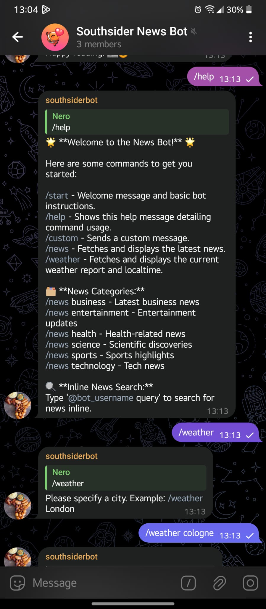
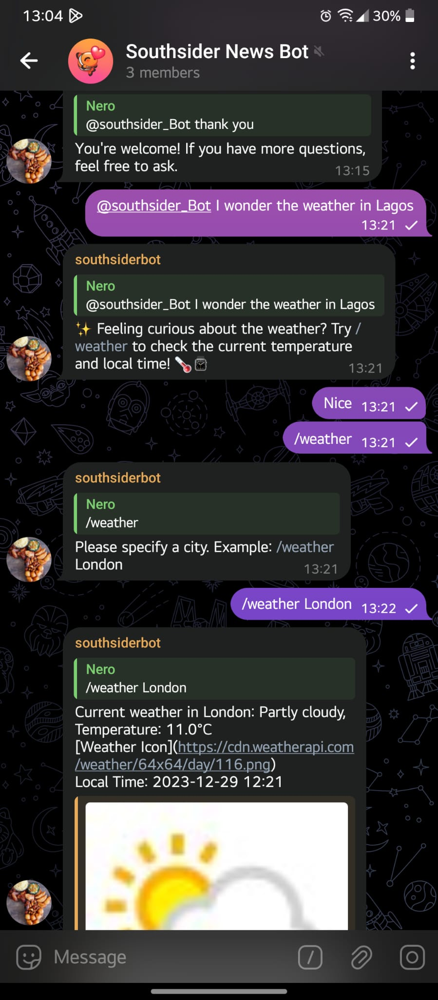

# Telegram News Bot





### Environment Setup

Setting up the environment for the Telegram News Bot is a straightforward process. To ensure a smooth experience, make sure to follow these steps:

1. **python-dotenv Documentation:**
   - Refer to the [python-dotenv documentation](https://pypi.org/project/python-dotenv/) for detailed instructions on how to set up and manage environment variables.

### Required APIs

The Telegram News Bot relies on the following APIs to provide accurate and up-to-date information. Before using the bot, it's essential to familiarize yourself with these APIs and obtain the necessary credentials:

1. **Gnews API Documentation:**

   - Explore the [Gnews API documentation](https://gnews.io/docs/v4#introduction) to understand how the bot fetches top headlines and news articles.

2. **WeatherAPI Documentation:**
   - Access the [WeatherAPI documentation](https://www.weatherapi.com/docs/) to learn about the integration that enables the bot to provide current weather conditions based on user queries.

Make sure to review and follow the API documentation thoroughly to ensure a seamless experience when using the Telegram News Bot.

## Installation

```bash
pip install -r requirements.txt
```

## Overview

The Telegram News Bot delivers the latest headlines to your Telegram chat seamlessly.

## Features

- **Top Headlines:** Use `/news` to get the latest news instantly.
- **Current Weather:** Use `/weather [city]` to fetch and display the current weather conditions for the specified city.
- **Command Variety:** Includes `/start`, `/help`, `/custom`, and natural language interaction.
- **Inline Queries:** Start a message with the bot's username for quick news results.

## Usage

- **Start the Bot:**

  ```
  /start
  ```

- **Get Help:**

  ```
  /help
  ```

- **Fetch Weather report:**

  ```
  /weather [city]
  ```

- **Fetch Latest News:**

  ```
  /news [query]
  ```

- **Inline Queries:**
  Start a message with the bot's username and a query.

## Contributing

Contributions are welcome! Open an issue or pull request for suggestions, bug reports, or new features.

## License

This project is licensed under the MIT License - see the [LICENSE](LICENSE) file for details.

---
